<p align="center">
  
</p>

# Documentación: Configuración de Motores de Base de Datos con Docker Compose

**Autor:** Harold Segundo Gonzalez  
**Docente:** Jaider J. Quintero Mendoza  
**Curso:** Base de Datos 2  
**Fecha:** 2026

---

## 📋 Tabla de Contenidos

1. [Requisitos Previos](#1-requisitos-previos)
2. [Creación de Carpetas](#2-creación-de-carpetas)
3. [Creación de la Red Docker](#3-creación-de-la-red-docker)
4. [Configuración de MySQL](#4-configuración-de-mysql)
5. [Configuración de PostgreSQL](#5-configuración-de-postgresql)
6. [Configuración de SQL Server](#6-configuración-de-sql-server)
7. [Conexiones desde DBeaver](#7-conexiones-desde-dbeaver)

---

## 1. Requisitos Previos

Antes de comenzar con la configuración de los motores de bases de datos, es necesario verificar que Docker esté correctamente instalado en el sistema. Docker es la plataforma que nos permite crear y gestionar contenedores para cada motor de base de datos.

Se ejecutaron los siguientes comandos para confirmar la instalación:

```bash
sudo docker --version
sudo docker compose version
```
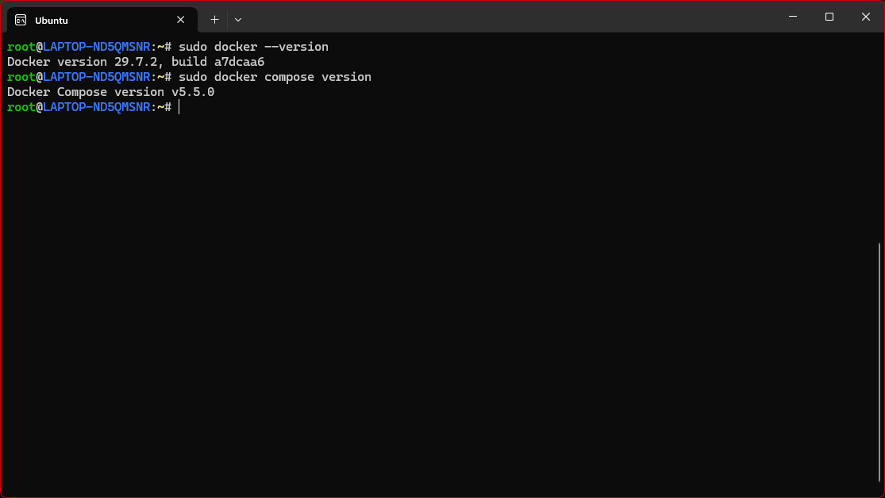

## 2. Creación de Carpetas
Para mantener un orden en el proyecto, se creó una estructura de carpetas que organiza los archivos de configuración y los datos de cada motor de base de datos. Esta estructura permite tener separados los servicios y facilita la administración de cada motor.

Se crearon las siguientes carpetas:

```bash
mkdir -p ~/ia-lab/services/motores-bd/{mysql,postgres,mssql,oracle}
mkdir -p ~/ia-lab/data/{mysql,postgres,mssql,oracle}
```

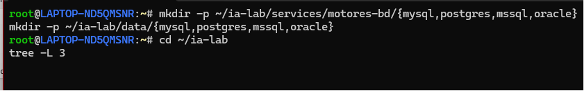
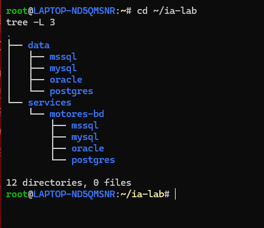

## 3. Creación de la Red Docker

Red compartida para contenedores
Para que todos los contenedores de bases de datos puedan comunicarse entre sí, se creó una red Docker compartida llamada ia-lab-network. Esta red permite que los contenedores se encuentren y se comuniquen utilizando sus nombres de contenedor como dirección.

```bash
docker network create ia-lab-network
```

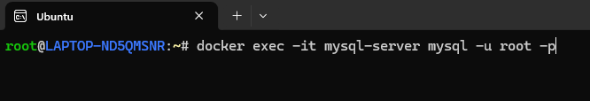

## 4. Configuración de MySQL

## 4.1 Archivos de configuración
Se crearon los archivos necesarios para configurar el contenedor de MySQL. El archivo docker-compose.yml define el servicio, y el archivo .env contiene las variables de entorno como la contraseña del usuario root y la base de datos inicial.

docker-compose.yml:

```bash
services:
  mysql:
    image: mysql:8.0
    container_name: mysql-server
    restart: unless-stopped
    env_file:
      - .env
    ports:
      - "3306:3306"
    volumes:
      - ../../../data/mysql:/var/lib/mysql
    command: >
      --character-set-server=utf8mb4
      --collation-server=utf8mb4_unicode_ci
      --bind-address=0.0.0.0
    networks:
      - ia-lab-network
    healthcheck:
      test: ["CMD", "mysqladmin", "ping", "-h", "localhost"]
      interval: 10s
      timeout: 5s
      retries: 5
      start_period: 30s

networks:
  ia-lab-network:
    external: true
```

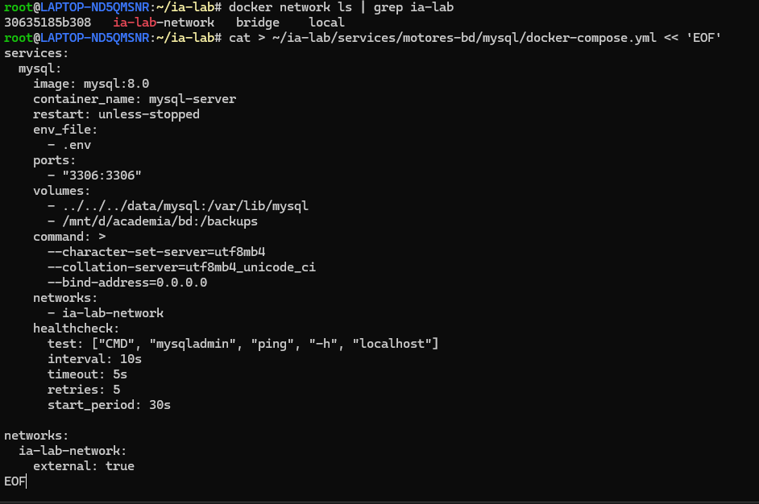

.env:

```bash
TZ=America/Bogota
MYSQL_ROOT_PASSWORD=123456
MYSQL_DATABASE=tecnogua
```
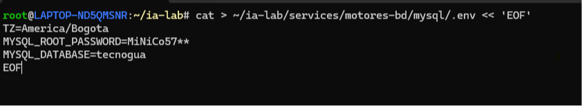

## 4.2 Levantar el contenedor

Se ejecutó el comando para levantar el contenedor de MySQL en segundo plano. El contenedor se descargó desde Docker Hub y se inició con la configuración definida.

```bash
cd ~/ia-lab/services/motores-bd/mysql
sudo docker compose up -d
```
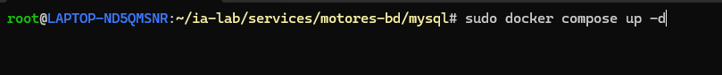

## 4.3 Creación de usuario propio con acceso remoto

Siguiendo la guía, se conectó al servidor MySQL como usuario root para crear un usuario personalizado con acceso desde cualquier equipo (%). Esto permite conectarse remotamente a la base de datos desde otros equipos de la red.

```bash
sudo docker exec -it mysql-server mysql -u root -p
# Password: 123456
```
```bash
CREATE DATABASE harold_db CHARACTER SET utf8mb4 COLLATE utf8mb4_unicode_ci;
CREATE USER 'harold'@'%' IDENTIFIED BY '123456';
GRANT ALL PRIVILEGES ON *.* TO 'harold'@'%';
GRANT ALL PRIVILEGES ON harold_db.* TO 'harold'@'%';
FLUSH PRIVILEGES;
```
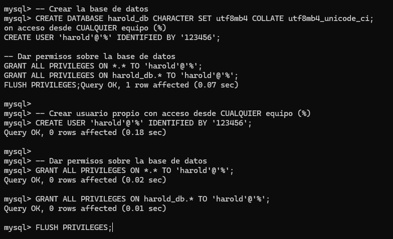

## 4.4 Verificación del usuario creado

Se verificó que el usuario harold haya sido creado correctamente con acceso desde cualquier equipo (%).

```bash
SELECT user, host FROM mysql.user WHERE user = 'harold';
```

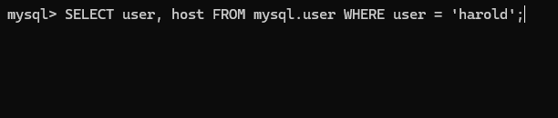
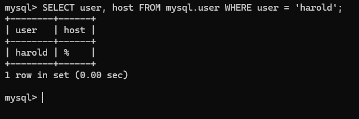

## 4.5 Prueba del nuevo usuario

Se probó la conexión al servidor MySQL utilizando el nuevo usuario harold para verificar que funciona correctamente.

```bash
sudo docker exec -it mysql-server mysql -u harold -p
# Password: 123456
```
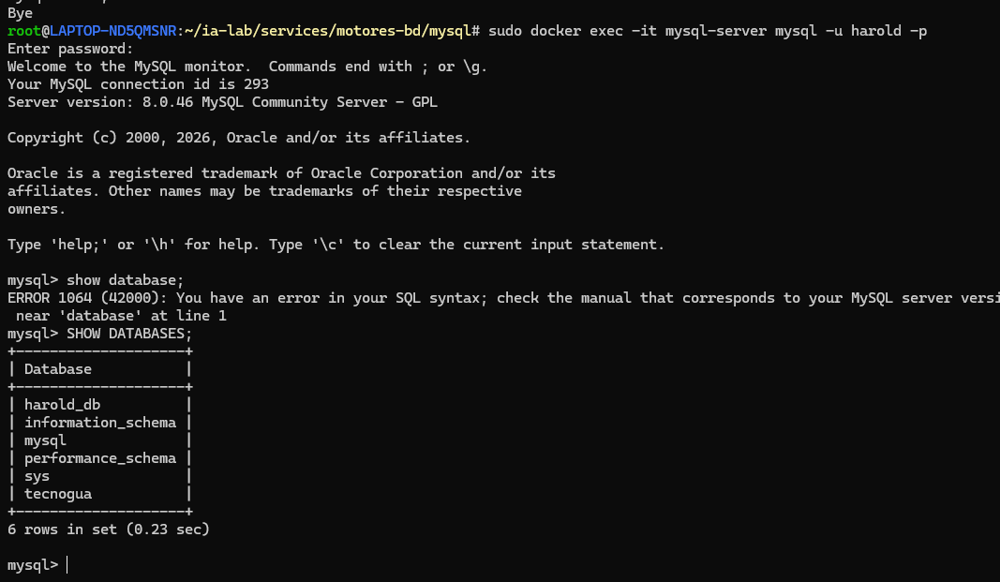


## 4.6 Prueba de conexión desde DBeaver

Una vez creado el usuario harold, se procedió a probar la conexión remota desde DBeaver.

Obtener la IP de WSL:

```bash
hostname -I
# IP obtenida: 172.24.20.10
```
Campo	        Valor

Host	        172.24.20.10

Port	        3306

Database	    harold_db

Username	    harold

Password	    123456

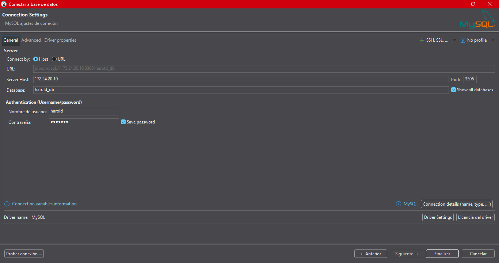

## 4.7 Backup de la base de datos

Se realizó una copia de seguridad de la base de datos harold_db utilizando el usuario harold. El backup se guardó en la carpeta /mnt/d/academia/bd/ con la fecha actual en el nombre del archivo.

```bash
sudo docker exec mysql-server mysqldump -u harold -p123456 harold_db > /mnt/d/academia/bd/backup_harold_db_$(date +%Y%m%d).sql
```
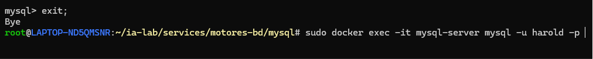

## 5. Configuración de PostgreSQL

## 5.1 Archivos de configuración

Se crearon los archivos de configuración para PostgreSQL. El archivo `.env` define el usuario administrador (`ialab`), la contraseña y la base de datos inicial.

docker-compose.yml:

```bash
```yaml
services:
  postgres:
    image: postgres:17
    container_name: ia-postgres
    restart: unless-stopped
    env_file:
      - .env
    ports:
      - "5433:5432"
    volumes:
      - ../../../data/postgres:/var/lib/postgresql/data
    networks:
      - ia-lab-network
    healthcheck:
      test: ["CMD-SHELL", "pg_isready -U $$POSTGRES_USER -d $$POSTGRES_DB"]
      interval: 10s
      timeout: 5s
      retries: 5
      start_period: 20s

networks:
  ia-lab-network:
    external: true
```
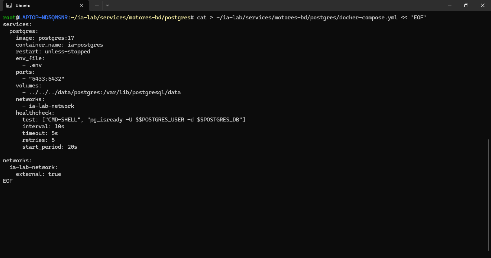

.env:

```bash
TZ=America/Bogota
POSTGRES_DB=ialab
POSTGRES_USER=ialab
POSTGRES_PASSWORD=123456
PGDATA=/var/lib/postgresql/data
```
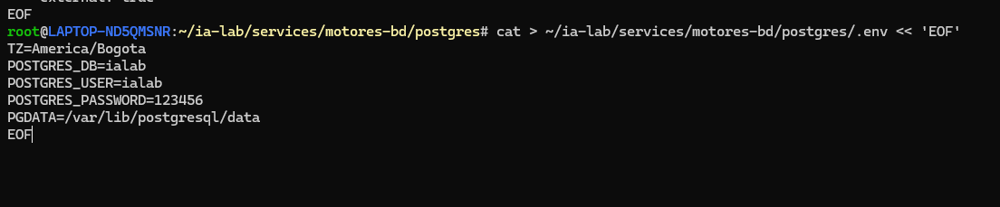

README.md:

```bash

> **Acceso remoto habilitado.** Puerto expuesto en `0.0.0.0:5433`.
> **Usuario por defecto:** `ialab` (acceso remoto: sin restriccion de host)
```
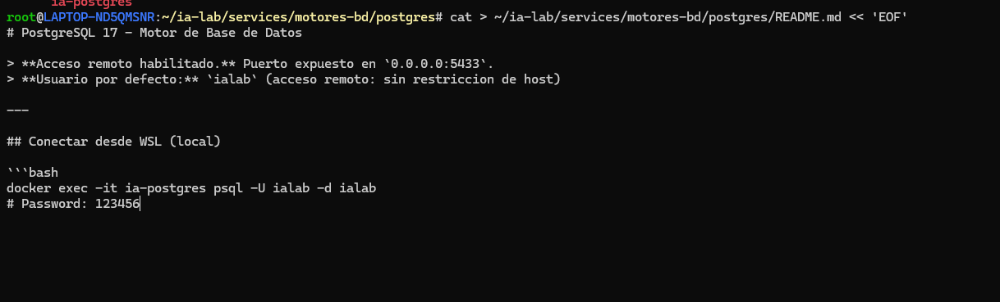

## 5.3 Creación de usuario propio

Se conectó a PostgreSQL como usuario ialab y se creó el usuario harold con permisos de superusuario y acceso a la base de datos harold_db.

```bash
sudo docker exec -it ia-postgres psql -U ialab -d ialab
# Password: 123456
```

```bash
CREATE DATABASE harold_db;
\c harold_db;
CREATE USER harold WITH PASSWORD '123456';
ALTER USER harold WITH SUPERUSER;
GRANT ALL PRIVILEGES ON DATABASE harold_db TO harold;
\du
```
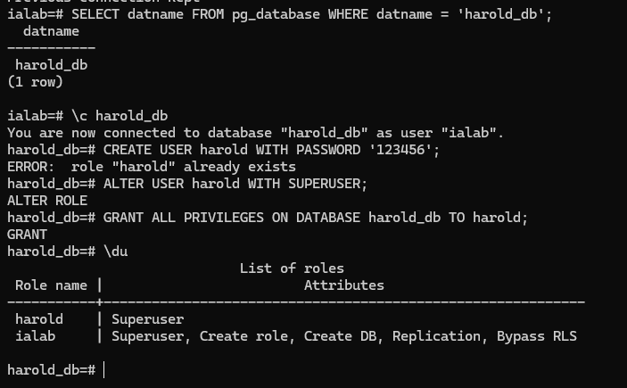

## 5.4 Prueba del nuevo usuario

Se probó la conexión al servidor PostgreSQL utilizando el nuevo usuario harold para verificar que funciona correctamente.

```bash
sudo docker exec -it ia-postgres psql -U harold -d harold_db
# Password: 123456
\list
```
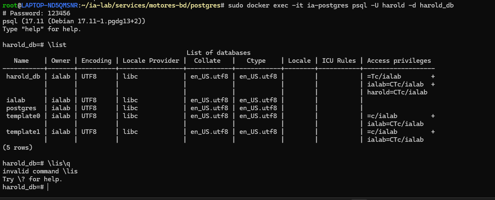

## 5.5 Prueba de conexión desde DBeaver

Una vez creado el usuario harold, se procedió a probar la conexión remota desde DBeaver.

Obtener la IP de WSL:

```bash
hostname -I
# IP obtenida: 172.24.20.10
```
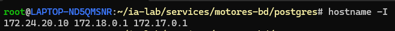
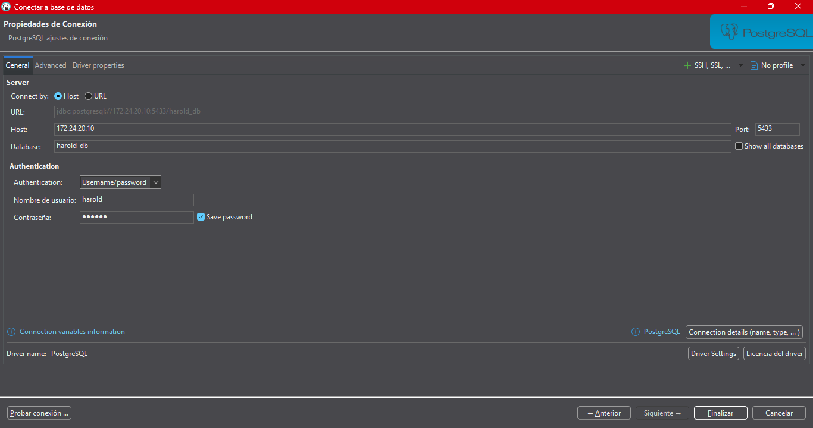

## 5.6 Backup de la base de datos

Se realizó una copia de seguridad de la base de datos harold_db utilizando el usuario harold.

```bash
sudo docker exec ia-postgres pg_dump -U harold -d harold_db > /mnt/d/academia/bd/backup_postgres_harold_db_$(date +%Y%m%d).sql
```
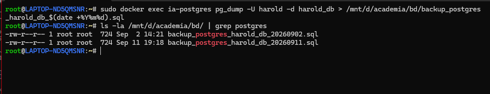

## 6. Configuración de SQL Server

## 6.1 Archivos de configuración

Se crearon los archivos de configuración para SQL Server. El archivo `.env` incluye la aceptación de la licencia y la contraseña del usuario `SA` con los requisitos de complejidad.

docker-compose.yml:

```bash
```yaml
services:
  mssql:
    image: mcr.microsoft.com/mssql/server:2022-latest
    container_name: sqlserver-container
    restart: unless-stopped
    user: root
    env_file:
      - .env
    ports:
      - "1433:1433"
    volumes:
      - ../../../data/mssql:/var/opt/mssql
    networks:
      - ia-lab-network

networks:
  ia-lab-network:
    external: true
```

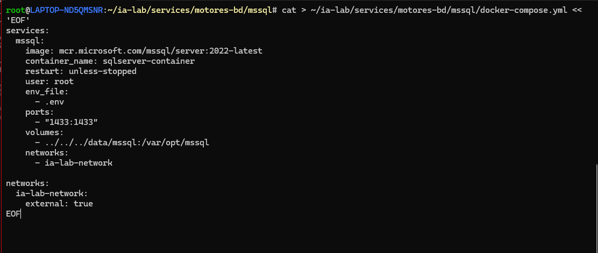

.env:

```bash
ACCEPT_EULA=Y
MSSQL_SA_PASSWORD=SqlServer2026!
MSSQL_PID=Developer
```

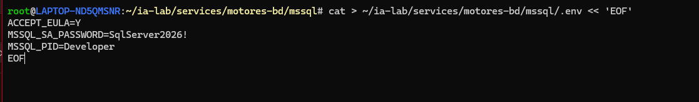

README.md:

```bash
# SQL Server 2022 - Motor de Base de Datos

> **Acceso remoto habilitado.** Puerto expuesto en `0.0.0.0:1433`.
> **Usuario por defecto:** `SA` (acceso remoto: habilitado por defecto)
```

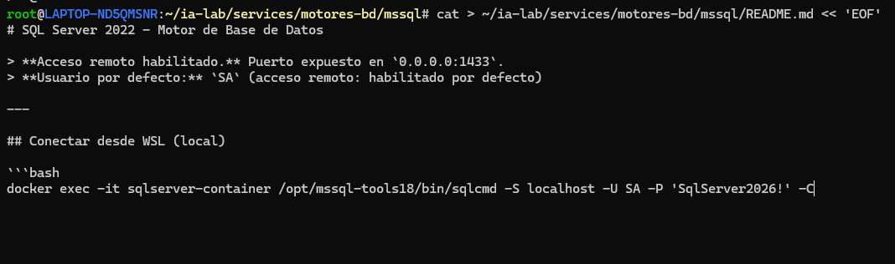

## 6.2 Levantar el contenedor

Se levantó el contenedor de SQL Server con el puerto 1433 expuesto.

```bash
cd ~/ia-lab/services/motores-bd/mssql
sudo docker compose up -d
```

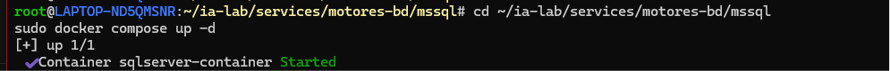

## 6.3 Creación de usuario propio
Se conectó a SQL Server como usuario SA y se creó el usuario harold con permisos de administrador.

```bash
sudo docker exec -it sqlserver-container /opt/mssql-tools18/bin/sqlcmd -S localhost -U SA -P 'SqlServer2026!' -C
```
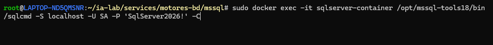
```bash
CREATE DATABASE harold_db;
GO
CREATE LOGIN harold WITH PASSWORD = '123456';
GO
USE harold_db;
GO
CREATE USER harold FOR LOGIN harold;
GO
ALTER ROLE db_owner ADD MEMBER harold;
GO
ALTER SERVER ROLE sysadmin ADD MEMBER harold;
GO
SELECT name, type_desc FROM sys.sql_logins WHERE name = 'harold';
GO
```
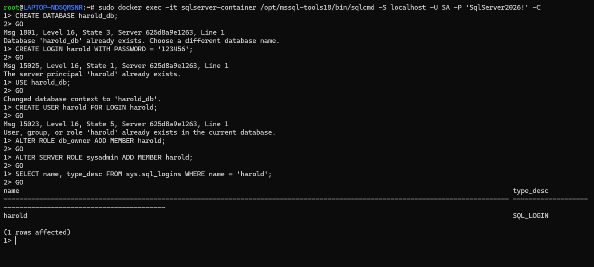

## 6.4 Prueba del nuevo usuario

Se probó la conexión al servidor SQL Server utilizando el nuevo usuario harold para verificar que funciona correctamente.

```bash
sudo docker exec -it sqlserver-container /opt/mssql-tools18/bin/sqlcmd -S localhost -U harold -P '123456' -C
```
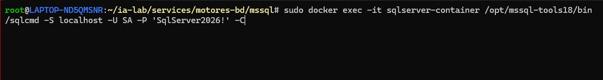
```bash
SELECT @@VERSION;
GO
```

## 6.5 Prueba de conexión desde DBeaver

Una vez creado el usuario harold, se procedió a probar la conexión remota desde DBeaver.

Obtener la IP de WSL:

```bash
hostname -I
# IP obtenida: 172.24.20.10
```

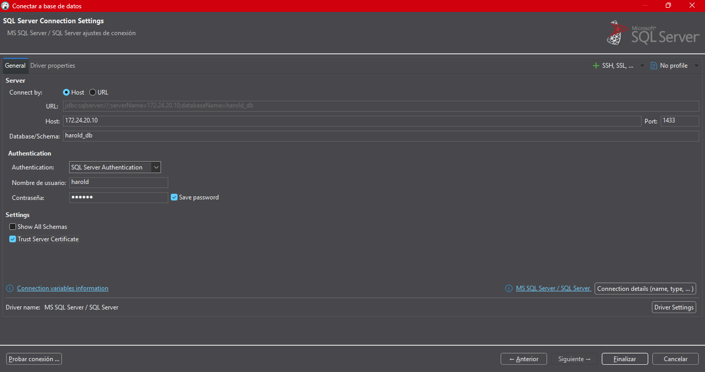
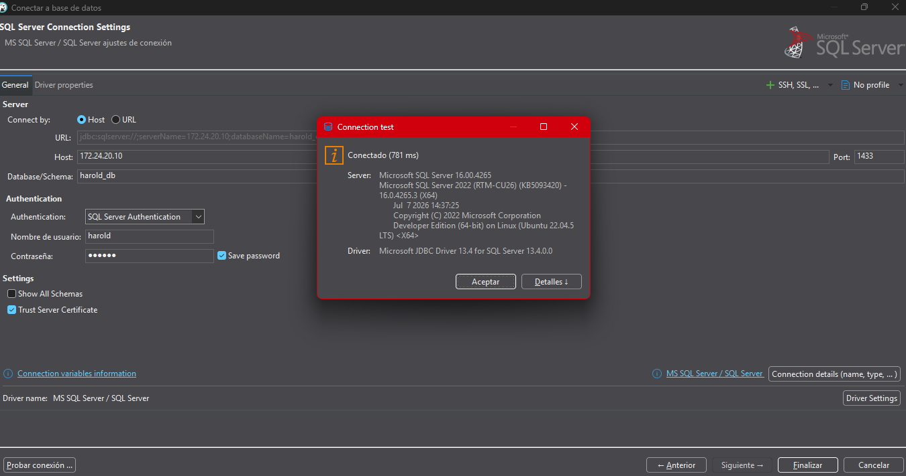

## 6.6 Backup de la base de datos

Se realizó una copia de seguridad de la base de datos harold_db utilizando el comando BACKUP DATABASE.

```bash
sudo docker exec sqlserver-container /opt/mssql-tools18/bin/sqlcmd -S localhost -U SA -P 'SqlServer2026!' -C -Q "BACKUP DATABASE [harold_db] TO DISK = N'/var/opt/mssql/backup_harold_db.bak'"
```

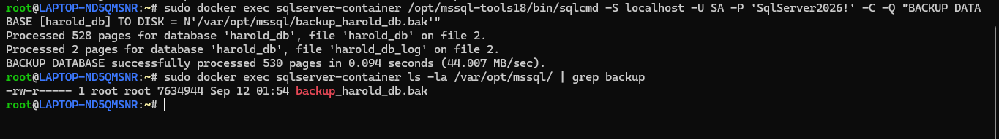

## 7. Configuración de Oracle XE

## 7.1 Archivos de configuración

Se crearon los archivos de configuración para Oracle XE. El archivo `.env` incluye la contraseña del usuario `SYSTEM` y el nombre de la instancia.

**docker-compose.yml:**

```bash
```yaml
services:
  oracle:
    image: gvenzl/oracle-xe:21-slim
    container_name: oracle-xe
    restart: unless-stopped
    env_file:
      - .env
    ports:
      - "1521:1521"
      - "8080:8080"
    volumes:
      - oracle-data:/opt/oracle/oradata
    networks:
      - ia-lab-network

networks:
  ia-lab-network:
    external: true

volumes:
  oracle-data:
```
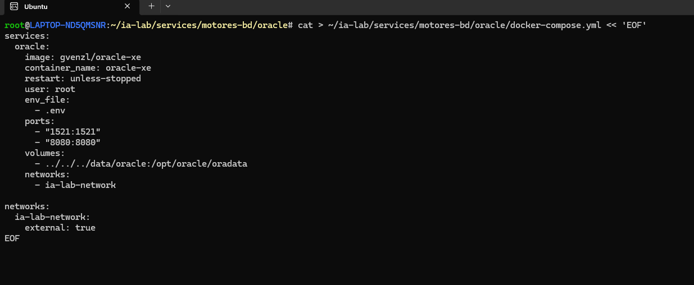

.env:

```bash
ORACLE_PASSWORD=123456
ORACLE_DATABASE=XE
```
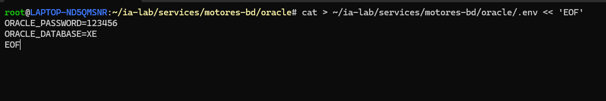

README.md:

```bash
# Oracle XE - Motor de Base de Datos

> **Acceso remoto habilitado.** Puerto expuesto en `0.0.0.0:1521`.
> **Usuario por defecto:** `SYSTEM` (acceso remoto: habilitado via listener)
```
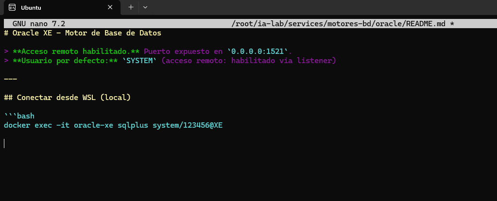

## 7.2 Levantar el contenedor

Se levantó el contenedor de Oracle con los puertos 1521 y 8080 expuestos.

```bash
cd ~/ia-lab/services/motores-bd/oracle
sudo docker compose up -d
```
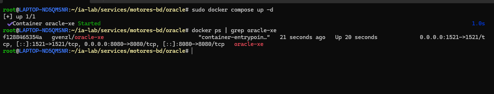
## 7.3 Conexión a Oracle

Se verificó la conexión a Oracle como usuario SYSTEM para confirmar que el contenedor esté funcionando correctamente.

```bash
sudo docker exec -it oracle-xe sqlplus system/123456@XE
```
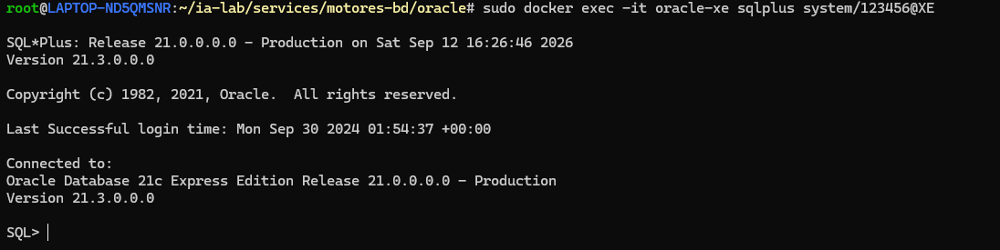

## 7.4 Creación de usuario propio

Se conectó a Oracle como usuario SYSTEM y se creó el usuario harold con permisos de administrador.

```bash
sudo docker exec -it oracle-xe sqlplus system/123456@XE
```

```bash
-- Conectar al PDB
ALTER SESSION SET CONTAINER = XEPDB1;

-- Crear tablespace
CREATE TABLESPACE harold_ts DATAFILE '/opt/oracle/oradata/XE/XEPDB1/harold_ts.dbf' SIZE 100M AUTOEXTEND ON;

-- Crear usuario
CREATE USER harold IDENTIFIED BY 123456 DEFAULT TABLESPACE harold_ts QUOTA UNLIMITED ON harold_ts;

-- Dar permisos
GRANT CREATE SESSION, CREATE TABLE, CREATE VIEW, CREATE SEQUENCE, CREATE TRIGGER TO harold;
GRANT DBA TO harold;
```
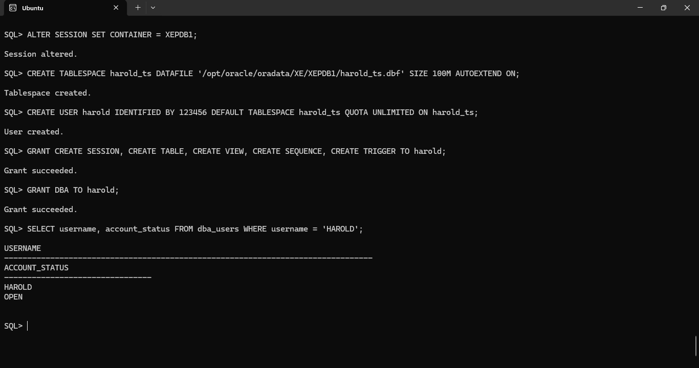

## 7.5 Prueba del nuevo usuario

Se probó la conexión a Oracle utilizando el nuevo usuario harold para verificar que funciona correctamente.

```bash
sudo docker exec -it oracle-xe sqlplus harold/123456@XEPDB1
```

```bash
SELECT USER FROM dual;
```
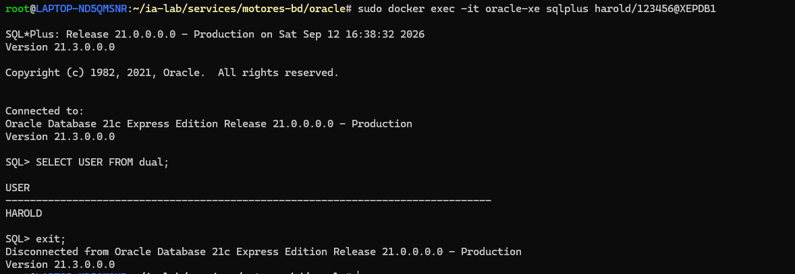

## 7.6 Prueba de conexión desde DBeaver

Una vez creado el usuario harold, se procedió a probar la conexión remota desde DBeaver.

Obtener la IP de WSL:

```bash
hostname -I
# IP obtenida: 172.24.20.10
```

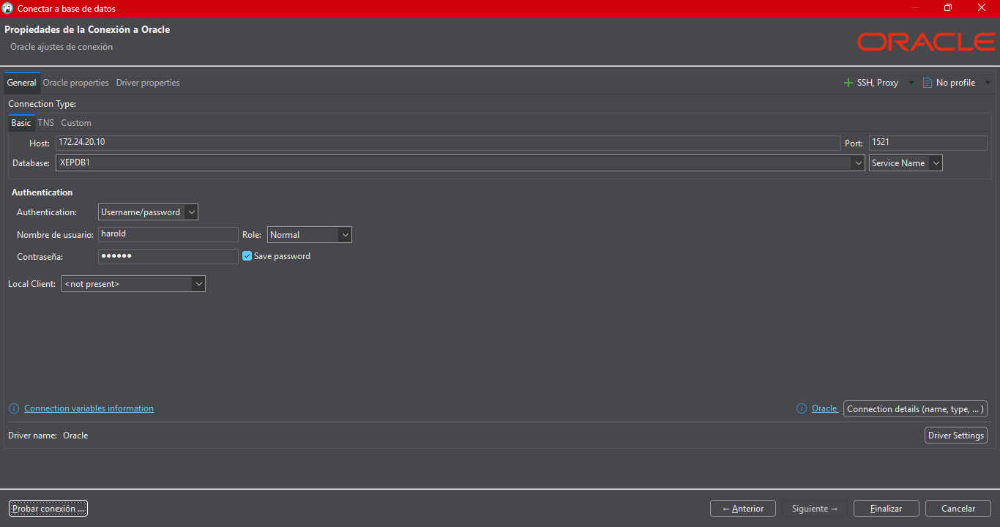
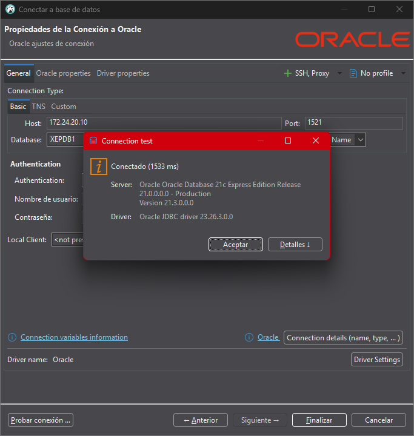

## 7.7 Backup de la base de datos

Se realizó una copia de seguridad de la base de datos harold utilizando la herramienta exp de Oracle.

```bash
sudo docker exec oracle-xe exp harold/123456@XEPDB1 file=/opt/oracle/oradata/backup_harold.dmp owner=harold
```

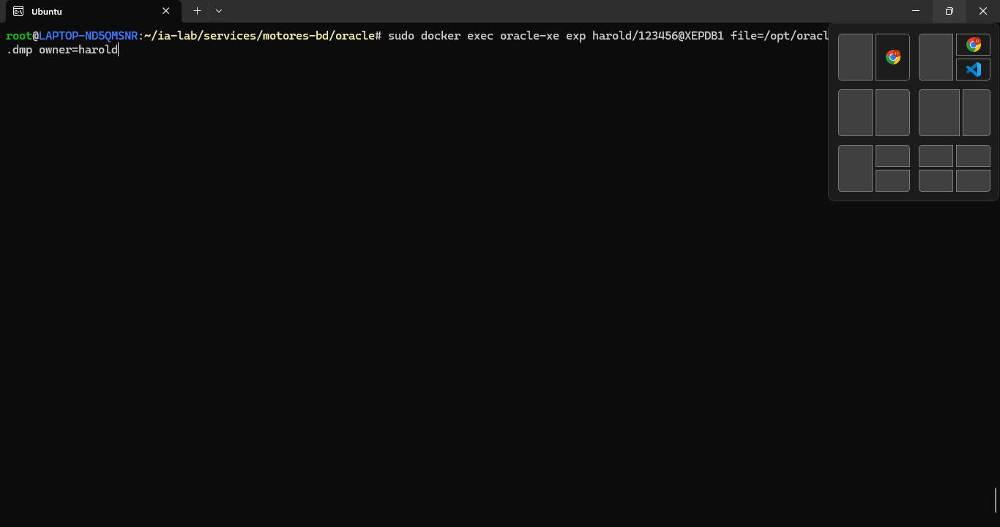